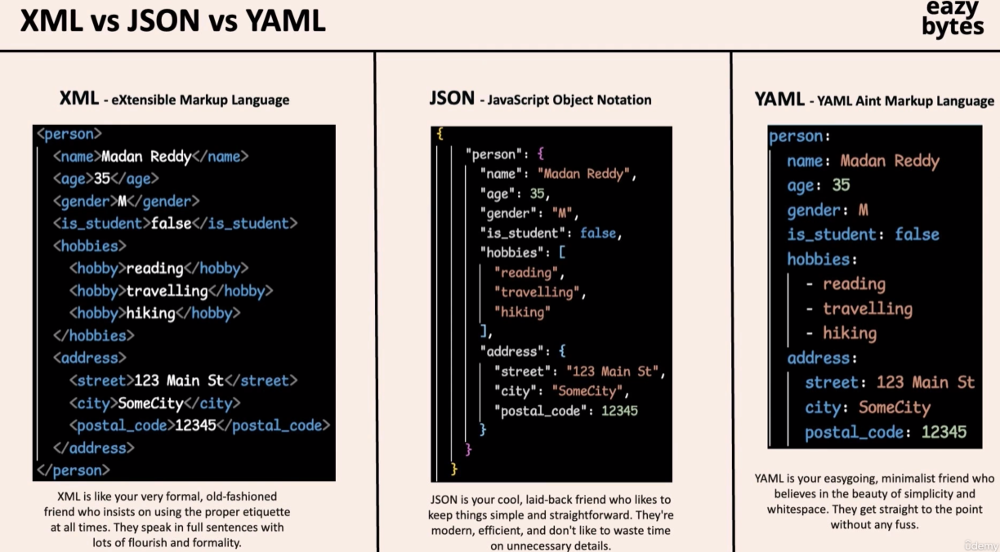

## YAML
Yet Another Markup Language -- initial full form
YAML Ain't Markup Language

human-readable data serialization standard that can be used in conjection with all programming languages and is often used to write configuration files. 

Features: 
- indentation
- flexible data types
    - strings, integers, floats, booleans, lists and dict
- cross platform

###### Common uses

Tools like Ansible, K8s, and Docker compose use YAML for their configuration files. 
Data Storage
Data Serialization
- serialize data for communication  between systems
    - when applications want to communicate between each other (XML, JSON, YAML)

`pip3 install PyYAML`
`pip3 install ruamel.yaml`

Key-Value format is followed when writing YAML files.

Sample Example files: `01_sample_yaml_file` folder

YAML is case sensitive
YAML is not a programming language
- it is a format how we can carry data from location A to location B

YAML is a superset of JSON

Difference between XML, JSON and YAML
In year 2000 --> XML was widely used
In year 2010 --> JSON became popular
From year 2018 --> YAML is popularly used for DevOps tools

##### Data Types

- Scalars
    - String
    - Numbers
    - Booleans
    - Data and Time
    - Null
    - Binary

- Collections
    - Sequences
        - List (duplicates allowed)
        - Set (unique elements always)
    - Mapping
        - Sequence Mappings

Single quotes ' ' in YAML do not interpret escape sequences
Double quoutes " " in YAML supports escape sequences like \n, \t, \ etc.

`See Example File == line 27 == sample.yml`

Literal Block Style (|)
- Multi line string
- it preserves the line break

Folded Block Style (>)
- Multi-line string without line breaks
- Line breaks are replaced with the space values

If you specify a `-` symbol, then all the line breaks after the value in the script are removed, 
If you want to retain the line breaks, then use the `+` symbol.

`See Example File == line 32 == sample.yml`

##### Data Structures

